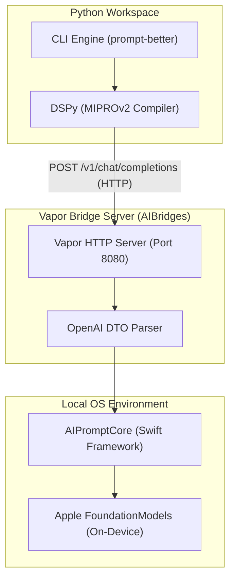

# AI Bridges (`AIBridges`)

`AIBridges` contains the lightweight Vapor-based bridge servers that expose Apple's local on-device LLMs (via the native `FoundationModels` framework, also known as Apple Intelligence) as an OpenAI-compatible REST API. 

By bridging the gap between Apple's Swift-only APIs and Python's automation ecosystem, these bridges allow the `prompt-better` optimizer to run validation benchmarks, execute prompts, and compile optimized prompt instructions directly on target Apple hardware over HTTP.

---

## Architecture Overview

The following diagram illustrates how the `prompt-better` CLI connects to on-device hardware through the bridge servers:



---

## Bridges Comparison

| Bridge | Platform | UI / Execution Mode | Core Purpose |
| :--- | :--- | :--- | :--- |
| **`macOS Bridge`** | macOS 26.0+ | Headless Command-Line Service | Best for headless script runtimes, local CI/CD pipelines, or background workflows on Apple Silicon Macs. |
| **`iOS Bridge`** | iOS 26.0+ | SwiftUI Dashboard Application | Best for physical iOS device and simulator testing. Features a start/stop server GUI, automatic local IP binding, and a live scrollable HTTP log stream. |

---

## API Endpoints Reference

Both the iOS and macOS bridges implement standard OpenAI-compatible endpoints to act as drop-in replacements for standard LLM providers.

### 1. Chat Completions
- **Route**: `POST /v1/chat/completions`
- **Content-Type**: `application/json`
- **Request Payload**:
  ```json
  {
    "model": "apple-intelligence",
    "messages": [
      {
        "role": "user",
        "content": "Summarize the key benefits of on-device LLMs."
      }
    ],
    "temperature": 0.0,
    "top_p": 1.0,
    "max_tokens": 128
  }
  ```
- **Response Payload**:
  ```json
  {
    "id": "chatcmpl-D09D5B48-A971-4DF0-97DF-D9EA19CA8208",
    "object": "chat.completion",
    "created": 1717491600,
    "model": "apple-intelligence",
    "choices": [
      {
        "index": 0,
        "message": {
          "role": "assistant",
          "content": "On-device LLMs offer reduced latency, complete user privacy, offline capability, and zero API token costs."
        },
        "finish_reason": "stop"
      }
    ],
    "usage": {
      "prompt_tokens": 0,
      "completion_tokens": 0,
      "total_tokens": 0
    }
  }
  ```

> [!NOTE]
> Since Apple's local `LanguageModelSession` does not natively return token usage details, the response returns `0` for `usage` fields.

### 2. List Models
- **Route**: `GET /v1/models`
- **Response**:
  ```json
  {
    "object": "list",
    "data": [
      {
        "id": "apple-intelligence",
        "object": "model",
        "created": 1717491600,
        "owned_by": "apple"
      }
    ]
  }
  ```

### 3. Health Check
- **Route**: `GET /health`
- **Response**: Text indicating that the server is online (e.g., `"Bridge is running on port 8080"` or `"iOS Bridge is running on port 8080"`).

---

## Setup & Running the Bridges

### 🖥️ macOS Bridge (`AIBridges/macOS`)

The macOS bridge runs as a lightweight terminal-based server.

1. **Navigate to the macOS bridge directory**:
   ```bash
   cd AIBridges/macOS
   ```
2. **Build the Swift package**:
   ```bash
   swift build -c release
   ```
3. **Run the server**:
   ```bash
   swift run App serve --hostname 127.0.0.1 --port 8080
   ```
   *To shut down the server, press `Ctrl+C` in your terminal.*

---

### 📱 iOS Bridge (`AIBridges/iOS`)

The iOS bridge is a SwiftUI application that can be run on an iOS Simulator or a physical iOS 26+ device. It automatically binds to your local network interface (WiFi) so that your Mac can connect to it.

#### 1. Generate the Xcode Project
The project uses **XcodeGen** to manage project structures dynamically. If you modify targets or package structures, regenerate the files:
```bash
cd AIBridges/iOS
xcodegen generate
```

#### 2. Build and Deploy from Xcode
1. Open [iosAIBridge.xcodeproj](iOS/iosAIBridge.xcodeproj) in Xcode.
2. Select the `iosAIBridge` scheme.
3. Target a connected physical iOS 26+ device or an iOS 26+ Simulator.
4. Click **Run** (`Cmd + R`).

#### 3. Operating the SwiftUI App
1. When launched, the app shows a premium splash screen before opening the dashboard.
2. Tap the **Start** button in the top right to start the Vapor server.
3. Once running, the dashboard shows:
   - **Status Indicator**: Green circle when running, red when stopped.
   - **Local Address**: The URL you should target (e.g. `http://192.168.1.45:8080/v1/models`).
   - **Live Logs ScrollView**: Auto-scrolls to print incoming HTTP requests (like `POST /v1/chat/completions`) and status responses (like `200 POST /v1/chat/completions`).

---

## Configuring `prompt-better` to Use the Bridge

To direct the Python client/optimizer to target your local bridge, configure the `student` block in your `prompt-better.json` configuration file, or set the environment variables:

```json
{
  "student": {
    "base_url": "http://127.0.0.1:8080/v1",
    "model": "apple-intelligence"
  }
}
```

Or via environment variables:
```bash
export PROMPT_BETTER_STUDENT_BASE_URL="http://127.0.0.1:8080/v1"
export PROMPT_BETTER_STUDENT_MODEL="apple-intelligence"
```

> [!TIP]
> **Physical iOS Device Testing:**
> If you are running `prompt-better` on your Mac but executing the student model on a physical iOS device, change the `base_url` to the IP address displayed on the iOS app's dashboard (e.g., `http://192.168.1.45:8080/v1`). Ensure both the Mac and iOS device are connected to the same local WiFi network.
