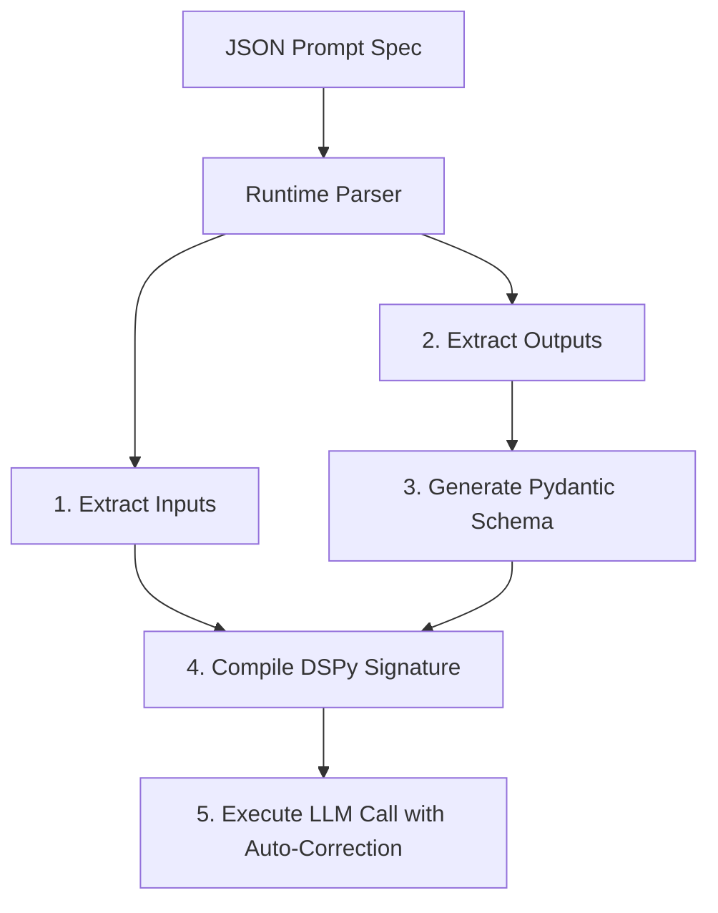
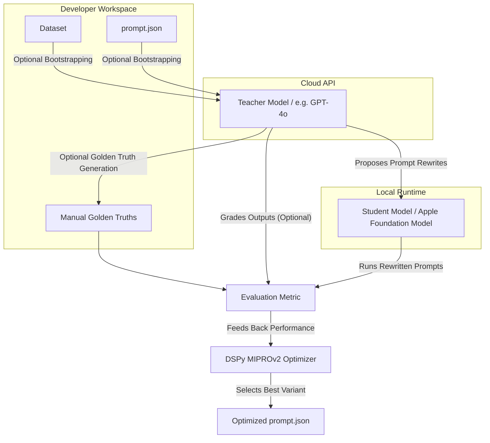
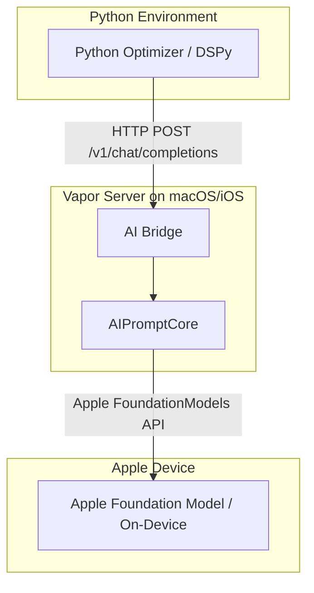

# JSON-Driven Prompt Optimization Framework based on DSPy

[](https://pypi.org/project/prompt-better/)
[](https://opensource.org/licenses/MIT)
[](https://pypi.org/project/prompt-better/)

__*Anything you can prompt, I can prompt better!*__


`prompt-better` is a generic, highly reusable, and platform-agnostic framework designed to validate, run, and optimize Large Language Model (LLM) prompts across any OpenAI-compatible API, local runtime, or on-device model. Built on top of **DSPy** and **Pydantic**, it automates complex instruction tuning and structured output validation.

## Framework Overview

> [!NOTE]
> **Universal Compatibility with Apple Optimization:**  
> While `prompt-better` is heavily optimized and equipped with a native toolchain for Apple ecosystems (macOS/iOS on-device runtimes), it is **completely generic and platform-agnostic by design**. You can use it in **any environment** to optimize **any prompt** targeting any standard LLM API (including OpenAI, Anthropic, local Llama.cpp, Ollama, Hugging Face, or local cloud endpoints).

Here are the key **USPs** of `prompt-better` as a DSPy optimization wrapper:

* **Cross-Language Apple Silicon Bridges (macOS & iOS):** Exposing Apple's proprietary on-device `FoundationModels` (Swift `LanguageModelSession`) to Python prompt tuning pipelines is notoriously difficult. `prompt-better` provides local **Vapor HTTP Bridges** for macOS and iOS that transform local on-device runtimes into standard OpenAI-compatible `/v1/chat/completions` API endpoints. This lets you optimize prompts directly on target physical Apple Silicon hardware.
* **Schema-Backed JSON Prompt Specifications (SSOT):** Prompts are defined as language-agnostic data assets (`prompt.json`) representing the **Single Source of Truth (SSOT)**. At runtime, `prompt-better` dynamically constructs type-safe Pydantic schemas, registers matching **DSPy Signatures**, and handles type-safe structured inference on-the-fly, completely abstracting Python class definitions from your workflows.
* **Decoupled Coached Student-Teacher Pipelines:** Smaller, resource-constrained models (such as on-device Apple weights or 3B–8B local runtimes) lack the reasoning capacity to propose instruction variants or grade outputs during optimization. We pair your target **Student** model (running locally on device) with a high-capacity **Teacher** model (such as GPT-4o in the cloud) to coach, proposal-write, and grade evaluations, ensuring the final compiled prompt is optimized specifically for the unique weights and limits of your target local hardware.
* **Native Swift Codegen & `@Generable` Integration:** Seamlessly transition from optimization to production. Our template-driven Swift generator translates compiled JSON prompt definitions directly into native, compile-ready Swift structs conforming to Apple's `@Generable` macro. Adding templates for other ecosystems (like Kotlin for Android or TypeScript) is simple and extensible.
* **Decoupled JSON Golden Truths (Human-in-the-Loop):** Evaluation is strictly compared against gold-standard reference cases stored as clean, structured JSON files. To prevent echo-chamber bias and data contamination, the CLI supports both automated Teacher draft bootstrapping and empty boilerplates, facilitating rigorous human-in-the-loop quality controls.
* **Robust Fallback Parser & Type Coercion Registry:** Smaller local models often struggle to output strict JSON schemas. `prompt-better` uses generic regex outer-bracket extraction to recover JSON structures wrapped in conversational model responses, and features a **Pluggable Fallback Registry** to perform automatic type coercions (mapping text to integers, floats, and booleans) before final returns.
* **SQLite Response Caching:** To minimize network costs and local device thermal throttling during intensive optimization runs, the framework integrates a transparent, hashing-based **SQLite Response Cache** that caches LLM/Vapor bridge queries dynamically by hashing request payloads.

---

## Getting Started

### 1. Prerequisites

- **Python 3.10+**
- **Xcode 26+** with the macOS 26 / iOS 26 SDK (for the Swift toolchain and Apple Foundation Models)
- A Mac with Apple Silicon running **macOS 26** (required for on-device `FoundationModels` inference)

### 2. Install the Python Package

To install the package in editable mode for local development:

```bash
cd prompt-better
python3 -m pip install -e .
```

### 3. Create a Prompt Folder

Create a directory under your prompts root. The framework uses **convention-over-configuration**: each prompt lives in its own folder containing standardized files.

```
prompts/
└── MyPrompt/
    ├── prompt.json          # Prompt specification (source of truth)
    ├── dataset/             # Evaluation input cases (inputs only)
    │   └── case1.json
    ├── golden-truth/        # Reference answers (manually provided or auto-generated)
    │   └── case1.json
    └── script/              # Optional: data extraction scripts
        └── extractor.swift
```

#### `prompt.json` — Prompt Specification

```json
{
  "name": "MyPrompt",
  "metadata": { "version": "1.0.0", "author": "Your Team" },
  "config": {
    "model_id": "base",
    "temperature": 0.0,
    "top_p": 1.0,
    "top_k": 1,
    "max_tokens": 1000,
    "stop_sequences": []
  },
  "instructions": {
    "prompt": "Identify the primary topic of this text:\n\nText: {{input}}",
    "context": [
      { "name": "input", "type": "string", "desc": "The raw input text." }
    ]
  },
  "outputs": [
    { "name": "topic", "type": "string", "desc": "The identified topic." }
  ]
}
```

#### `dataset/case1.json` — Evaluation Input

```json
{
  "id": "case1",
  "inputs": {
    "input": "The Berlin Senate is funding new solar panels in dense neighborhoods."
  }
}
```

### 4. Configure Your LLM Endpoints

Create a `config.json` file **one level above** your prompts directory (i.e. next to the `prompts/` folder):

```
my-project/
├── config.json          ← here
└── prompts/
    └── MyPrompt/
        └── prompt.json
```

```json
{
  "student": {
    "base_url": "http://localhost:8080/v1",
    "model": "apple/foundation-model",
    "api_key": ""
  },
  "teacher": {
    "base_url": "https://api.openai.com/v1",
    "model": "gpt-4o",
    "api_key": "YOUR_API_KEY"
  },
  "auto_mode": "light",
  "num_threads": 6,
  "train_ratio": 0.8
}
```

> **Convention:** The CLI resolves `config.json` as the **parent directory** of the `--prompts-dir` you pass.  
> All settings can also be overridden with `PROMPT_BETTER_*` environment variables (see [Configuration](#configuration--environment-variables) below).

### 5. Validate and Optimize

```bash
# List all discovered prompts
python3 -m prompt_better.cli list-prompts \
  --prompts-dir ./prompts

# Validate your baseline prompt against the Student model
python3 -m prompt_better.cli validate \
  --prompts-dir ./prompts \
  --dataset ./data \
  --prompt MyPrompt

# Run DSPy MIPROv2 compilation to optimize prompt instructions
python3 -m prompt_better.cli optimize \
  --prompts-dir ./prompts \
  --dataset ./data \
  --prompt MyPrompt
```

---

## Key Core Architectures

### 1. JSON Specifications as the Source of Truth
Instead of hardcoding prompt structures or outputs in python source files, each prompt is declared in a standard JSON specification:
- **`instructions`:** Defines the template text and the system context, employing `{{placeholder}}` strings for dynamic input mapping.
- **`config`:** Defines model parameters (temperature, top_p, stop sequences, token limits).
- **`inputs`:** Lists input variables with descriptions and types.
- **`outputs`:** Outlines expected output structures, fully supporting `string`, `integer`, `number`, and `boolean` types (and primitive arrays of them). Values are coerced at runtime to ensure complete type compliance.

### 2. Dynamic DSPy Signature & Pydantic Mapping

At runtime, the framework loads the JSON prompt specification, dynamically builds type-safe Pydantic schemas, registers a corresponding DSPy Signature, and handles structured inference:



1. **Pydantic Schema Synthesis:** Dynamically constructs a type-safe **Pydantic schema** representing the desired output structure, using the `desc` values in the JSON as field descriptions. Both inputs and outputs are dynamically mapped to corresponding Python types (`int`, `float`, `bool`, `str`).
2. **DSPy Signature Registration:** Matches input variables directly to the JSON's placeholders, and binds outputs to the Pydantic structured output model.
3. **Execution & Self-Correction:** Automatically processes responses and performs self-correction or structural fallback loops under the hood.

### 3. SQLite Response Caching
To minimize network costs and local device processor load when testing or compiling loops on mobile device bridges, the framework integrates a transparent, hashing-based **SQLite Response Cache**:
* **Mechanism:** Computes a unique key by hashing the entire request signature: `sha256(model + messages + schema + temperature)`.
* **Behavior:** Cache hits bypass network and local Vapor bridge queries, dramatically speeding up repetitive validation runs.
* **Control:** Cache is stored locally at `.prompt_better_cache.db` in the workspace root. Disable caching at any time by setting `PROMPT_BETTER_DISABLE_CACHE=1` in your environment.

### 4. Live Optimizer Console Telemetry
During optimization runs (MIPROv2 compile loops), the optimizer prints a dynamic console progress dashboard. This gives you instant visibility into:
* The live number of candidate prompt variations evaluated.
* Live-updating average and best metric scores.
* The absolute metric lift compared directly to your unoptimized baseline score.

### 5. Student-Teacher Optimization Pipeline & Golden Truths

The optimization pipeline decouples execution and validation by pairing your target model with custom verification metrics, golden references, and an optional high-capacity teacher model:



#### Decoupled Reference Answers ("Golden Truths")

To measure prompt improvement, the optimizer compares student outputs against gold-standard reference answers ("golden truths").

> [!WARNING]
> **The Danger of Blind Model Generation:** Using an LLM to generate its own validation benchmarks can lead to **data contamination** and **echo-chamber bias**, where the student model is tuned simply to mimic the specific errors or stylistic quirks of the teacher model rather than learning actual ground-truth facts. **Human-written references are the absolute gold standard for prompt engineering.**

To facilitate high-quality testing, the framework supports two distinct approaches for reference answers:

* **Manually Provided (Recommended/Standard):**
  You author your own human-grade expected outputs inside the `golden-truth/` folder. This ensures evaluation metrics are strictly matched to your actual business logic, factual databases, or editorial guidelines.

* **Automated Scaffolding Helper (`generate-golden-truth` command):**
  To save you from typing out structured JSON files from scratch, the CLI includes a `generate-golden-truth` command. It behaves dynamically based on your environment:
  * **No Teacher Configured (Boilerplate Creator):** The command reads your `prompt.json` output specifications and generates a **completely empty JSON skeleton** inside the `golden-truth/` folder matching your structure. This provides a perfect starting boilerplate for your manual entries.
  * **Teacher Configured (Draft Bootstrapper):** It calls your high-capacity **Teacher Model** to write initial draft reference outputs and boilerplate evaluation rubrics. You are expected to manually review, edit, and curate these files before running optimization cycles.

#### The Orchestration Roles
* **Student Model:** The target model where the prompt will run in production (typically a smaller, local, or on-device model, such as Apple's Foundation Models or a local Llama 3 instance).
* **Teacher Model:** A higher-capacity cloud model (like GPT-4o or Claude 3.5 Sonnet) used optionally to:
  - Generate reference answers when not manually provided.
  - Grade student responses on complex quality axes (coherence, sentiment, tone).
  - Act as a prompt proposer to write instruction variants for DSPy optimizers (such as `MIPROv2`).

#### `validate` — Baseline Measurement

Sends your **unmodified** prompt to the Student model for each test case in the dataset, then scores the output without changing anything. For each example it:

1. Resolves `{{placeholder}}` tokens in `prompt.json` with the example's input values.
2. Calls the Student via the OpenAI-compatible `/v1/chat/completions` endpoint.
3. Scores the response on three axes:
   - **Structural score** (55% weight) — did the model return all expected fields with correct types?
   - **Similarity score** (45% weight) — how close is the output to the golden-truth reference?
   - **Teacher score** (optional) — the Teacher grades quality on a 0.0–1.0 scale with a written rationale.

Run `validate` first to establish a baseline, then `optimize`, then `validate` again to measure the lift.

#### `optimize` — The MIPROv2 Loop

The optimization is **not** brute-force variation testing. The Teacher actively coaches the Student:

1. **Teacher proposes prompt rewrites** — MIPROv2 uses the Teacher (`prompt_model`) to generate reworded instructions: different phrasings, more detail, reordered sections, added few-shot demonstrations.
2. **Student executes each candidate** — the rewritten prompt is sent to the Student (`task_model`) against the training dataset split.
3. **Metric scores the output** — combining structural correctness and similarity to golden-truth references.
4. **MIPROv2 iterates** — informed by which candidates scored well, it proposes new variations. The `auto` mode controls search depth:
   - `light` — fast, fewer candidates (good for iteration)
   - `medium` — balanced
   - `heavy` — exhaustive search (best results, slow)
5. **Best candidate wins** — scored on the held-out eval set, then graded again by the Teacher as a judge.

#### Where the Winning Prompt Ends Up

| Output | Location |
| :--- | :--- |
| Human-readable winning instruction | `<PromptFolder>/results/{PromptName}.report.json` → `"extracted_instruction"` field |
| Full compiled DSPy module (instruction + few-shot demos) | `<PromptFolder>/results/{PromptName}.dspy.json` |

The report is also printed to stdout. Review the `extracted_instruction`, and if you're satisfied, re-run with `--apply` to write it back into the source `prompt.json`.


## Swift Toolchain

The framework includes a complete Swift toolchain for bridging Apple's on-device `FoundationModels` framework to the Python optimizer and for generating production-ready Swift code from JSON prompt definitions.

### Architecture Overview



### AIPromptCore — Shared Swift Framework

`frameworks/AIPromptCore/` is a Swift Package that provides the shared protocol and session management used by both the main app and the iOS bridge.

| File | Purpose |
| :--- | :--- |
| `GenerableWithPrompt.swift` | Protocol extending Apple's `Generable`. Declares `systemPrompt` and `options`; provides `buildSystemPrompt(for:context:)` to resolve `{{placeholder}}` tokens. |
| `AISessionController.swift` | `@MainActor` singleton wrapping `LanguageModelSession`. Handles session lifecycle and structured generation via `respond(to:generating:)`. |
| `AIPrompt.swift` | Codable model matching the JSON prompt schema. Includes `Config.toGenerationOptions()` bridge to `FoundationModels.GenerationOptions`. |

**Platforms:** iOS 26.0+, macOS 26.0+  
**Swift tools version:** 6.0  
**Library type:** Dynamic (`.dynamic`)

#### Building the XCFramework

To produce an XCFramework for distribution (iOS device + Simulator slices):

```bash
cd frameworks/AIPromptCore
./build_xcframework.sh
# Output: build/AIPromptCore.xcframework
```

#### Integrating in Your Main Xcode Project

Add the `AIPromptCore` package as a local dependency in your app's `Package.swift` or Xcode project:

```swift
// In your app's Package.swift
dependencies: [
    .package(path: "path/to/prompt-better/frameworks/AIPromptCore")
],
targets: [
    .target(
        name: "MyApp",
        dependencies: [
            .product(name: "AIPromptCore", package: "AIPromptCore")
        ]
    )
]
```

Then `import AIPromptCore` and conform your generated prompt structs to `GenerableWithPrompt`:

```swift
import AIPromptCore
import FoundationModels

@Generable
struct MyPrompt: GenerableWithPrompt {
    static let systemPrompt = "Identify the primary topic of this text:\n\nText: {{input}}"
    static let options: GenerationOptions? = nil

    var topic: String
}

// Usage:
let result = try await AISessionController.shared.respond(
    to: articleText,
    generating: MyPrompt.self,
    createNewSession: true
)
print(result.topic)
```

> The `generate` CLI subcommand automates this — it reads a `prompt.json`, renders a Jinja template, and emits a complete, compile-ready Swift struct conforming to `GenerableWithPrompt`.

### AI Bridges — Vapor HTTP Servers

The bridges expose Apple's on-device `FoundationModels` as an **OpenAI-compatible** REST API so the Python optimizer can treat it like any other `/v1/chat/completions` endpoint.

| Bridge | Path | Dependencies | Notes |
| :--- | :--- | :--- | :--- |
| **iOS** | `AIBridges/iOS/` | Vapor + AIPromptCore | Uses `AISessionController` for structured generation. Requires an iOS 26 device or simulator. Build via Xcode or `xcodebuild`. |
| **macOS** | `AIBridges/macOS/` | Vapor | Standalone `LocalAIBridge` wrapping `LanguageModelSession` directly. Runs natively on macOS 26 Apple Silicon. |

#### Running the macOS Bridge

```bash
cd AIBridges/macOS
swift build
swift run App serve --hostname 0.0.0.0 --port 8080
```

The Python optimizer can now target `http://localhost:8080/v1` as the student endpoint in `config.json`.

#### Running the iOS Bridge

The iOS bridge must be built and run via Xcode on a device or simulator (requires iOS 26):

```bash
cd AIBridges/iOS
# Generate the Xcode project (uses XcodeGen):
./generate_project.sh
open iosAIBridge.xcodeproj
```

Build and run on an iOS 26 device. The Vapor server starts on the device at `http://<device-ip>:8080/v1`.

### Swift Code Generator

Generates type-safe `GenerableWithPrompt` Swift structs from JSON prompt definitions:

```bash
# Single prompt:
python3 -m prompt_better.cli generate \
  --source ./prompts/MyPrompt/prompt.json \
  --target ./Generated/MyPrompt.swift \
  -language swift
```

`-language <language>` resolves a bundled template named `prompt_better/templates/<language>_gen.jinja2` and reports an error if that template is not available. For example, `-language swift` uses `swift_gen.jinja2`; adding `kotlin_gen.jinja2` makes `-language kotlin` available. Alternatively, pass `-template` / `--template` with your own Jinja template path:

```bash
python3 -m prompt_better.cli generate \
  --source ./prompts/MyPrompt/prompt.json \
  --target ./Generated/MyPrompt.swift \
  -template ./templates/custom_swift.jinja2
```

The generated struct is production-ready — `import AIPromptCore`, conform to `GenerableWithPrompt`, include it in your Xcode target, and call via `AISessionController`.

---

## Directory Structure

- **`prompt_better/`** — Core Python package
  - `cli.py` — Reusable command-line interface exposing subcommands.
  - `json_prompts.py` — Dynamic JSON prompt specification parser and Pydantic model builder.
  - `models.py` — OpenAI-compatible structured output client and teacher/student orchestration.
  - `dataset.py` — Loader for prompt-specific evaluation cases.
  - `optimizer.py` — DSPy MIPROv2 compiler and multithreaded evaluation pipeline.
  - `golden_generator.py` — Golden-truth reference generator and evaluation rubric builder.
  - `swift_generator.py` — Template-driven codegen module translating JSON prompt definitions into generated files.
- **`frameworks/AIPromptCore/`** — Shared Swift package
  - `GenerableWithPrompt.swift` — Protocol bridging JSON prompts to Apple's `Generable`.
  - `AISessionController.swift` — `@MainActor` session manager wrapping `LanguageModelSession`.
  - `AIPrompt.swift` — Codable model matching the JSON prompt schema.
  - `build_xcframework.sh` — Builds the XCFramework for iOS device + simulator.
- **`AIBridges/iOS/`** — iOS Vapor bridge (OpenAI-compatible server using AIPromptCore)
- **`AIBridges/macOS/`** — macOS Vapor bridge (standalone `LocalAIBridge`)
- **`tests/`** — Pytest suite validating parser safety, JSON serializations, and schema builders.
- **`prompt-schema.json`** — JSON Schema for validating prompt definition files.
- **`pyproject.toml`** — Standalone Python dependency configuration.

---

## Standalone CLI Reference

```bash
python3 -m prompt_better.cli [SUBCOMMAND] [ARGS]
```

### Subcommands

| Command | Description | Key Arguments |
| :--- | :--- | :--- |
| `list-prompts` | Lists all prompts discovered in the prompts directory. | `--prompts-dir` |
| `preview-schema` | Prints the Pydantic/JSON schema generated from a prompt. | `--prompts-dir`, `--prompt` |
| `validate` | Runs evaluation cases against the Student model. | `--prompts-dir`, `--dataset`, `--prompt` |
| `optimize` | Compiles and optimizes instructions via DSPy MIPROv2. | `--prompts-dir`, `--dataset`, `--prompt` |
| `generate-golden-truth` | Creates empty skeleton boilerplates or LLM draft reference cases inside `golden-truth/`. | `--prompts-dir`, `--dataset-dir`, `--prompt`, `--case-id` |
| `generate` | Generates a file from JSON using either a built-in language template or a custom Jinja template. | `--source`, `--target`, `-language` / `--language`, `-template` / `--template` |

### Runtime Arguments (validate / optimize)

| Argument | Default | Description |
| :--- | :--- | :--- |
| `--auto` | `light` | DSPy auto mode for MIPROv2 (`light`, `medium`, `heavy`). |
| `--num-threads` | `6` | Parallel evaluation threads. |
| `--train-ratio` | `0.8` | Train/eval split ratio for datasets. |
| `--apply` | (flag) | Write optimized prompts back to the source JSON files. |

---

## Gradle Pipeline (Optional)

If your project uses Gradle for orchestration, the included `build.gradle.kts` wraps the Python CLI with Gradle tasks and provides sensible defaults:

```bash
# Setup virtual environment and install dependencies
./gradlew install

# Run Python test suite
./gradlew test

# List all prompt specifications
./gradlew list

# Preview JSON schema for a prompt
./gradlew previewSchema -PpromptOptimizationPrompt=MyPrompt

# Validate a prompt
./gradlew validate -PpromptOptimizationPrompt=MyPrompt

# Optimize a prompt
./gradlew optimize -PpromptOptimizationPrompt=MyPrompt

# Generate Swift structs for all prompts
./gradlew generateSwiftPrompts
```

The Gradle tasks read defaults from `build.gradle.kts` properties and pass them through to the CLI. Override paths with `-P` flags:

```bash
./gradlew validate \
  -PpromptOptimizationPromptsDir=../prompts/ios/prompts \
  -PpromptOptimizationPrompt=ArticleInsight
```

For Swift generation, the embedding project chooses the output directory and can use the built-in Swift template:

```bash
./gradlew generateSwiftPrompts \
  -PpromptOptimizationPromptsDir=../prompts/ios/prompts \
  -PpromptOptimizationSwiftOutputDir=../iosApp/iosApp/AI/Generated \
  -PpromptOptimizationLanguage=swift
```

To override the built-in template, pass `-PpromptOptimizationTemplate=path/to/template.jinja2`.

---

## Configuration & Environment Variables

The framework reads settings from `config.json` (resolved from the parent of `--prompts-dir`) with environment variable overrides taking precedence.

| Environment Variable | Description |
| :--- | :--- |
| **`PROMPT_BETTER_STUDENT_BASE_URL`** | API endpoint for the target Student model. |
| **`PROMPT_BETTER_STUDENT_MODEL`** | Model identifier for the Student runtime. |
| **`PROMPT_BETTER_STUDENT_API_KEY`** | Authentication key for the Student API. |
| **`PROMPT_BETTER_TEACHER_BASE_URL`** | API endpoint for the Teacher model. |
| **`PROMPT_BETTER_TEACHER_MODEL`** | Model identifier for the Teacher model. |
| **`PROMPT_BETTER_TEACHER_API_KEY`** | Authentication key for the Teacher API. |
| **`PROMPT_BETTER_NUM_THREADS`** | Maximum threads for parallel evaluations. |
| **`PROMPT_BETTER_TRAIN_RATIO`** | Train/test split ratio (e.g. 0.8) for dataset partition. |
| **`PROMPT_BETTER_DISABLE_CACHE`** | Set to `1` to bypass the SQLite response caching layer for JSON schema calls. |

> **Precedence:** Environment variables > `config.json` > CLI defaults.  
> **Local dev servers** (`localhost` / `127.0.0.1`) don't require an API key.

---

## JSON Specification Schema

See `prompt-schema.json` for the full JSON Schema. Here is a representative example:

```json
{
  "name": "TranslationPrompt",
  "metadata": {
    "version": "1.0.0",
    "author": "Core AI Team"
  },
  "config": {
    "model_id": "base",
    "temperature": 0.1,
    "top_p": 1.0,
    "top_k": 1,
    "max_tokens": 1000,
    "stop_sequences": []
  },
  "instructions": {
    "prompt": "Translate this text into the target language:\n\nLanguage: {{target_language}}\nText: {{text}}",
    "context": [
      {
        "name": "text",
        "type": "string",
        "desc": "The source text to translate."
      },
      {
        "name": "target_language",
        "type": "string",
        "desc": "The destination language."
      }
    ]
  },
  "outputs": [
    {
      "name": "translated_text",
      "type": "string",
      "desc": "The translated result."
    },
    {
      "name": "detected_source_language",
      "type": "string",
      "desc": "The language detected in the source text."
    }
  ]
}
```

At runtime, this JSON translates instantly into a Pydantic model with fields `translated_text` and `detected_source_language`, enforcing strict, type-safe outputs when executing optimizations or baseline runs.
