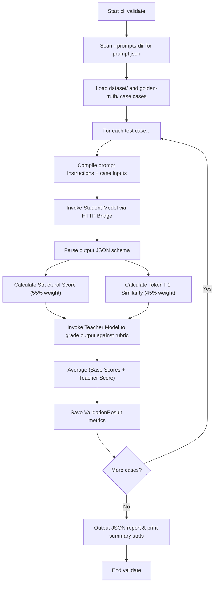
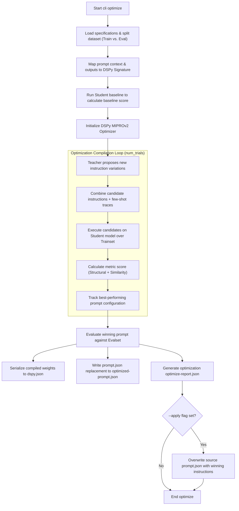

# JSON-Driven Prompt Optimization Framework based on DSPy

[](https://pypi.org/project/prompt-better/)
[](https://opensource.org/licenses/MIT)
[](https://pypi.org/project/prompt-better/)

**_ANYTHING YOU CAN PROMPT, I CAN PROMPT BETTER!_**

---

## 1. What This Is About

`prompt-better` is a generic, reusable, and platform-agnostic framework designed to validate, execute, and optimize Large Language Model (LLM) prompts. Instead of hardcoding prompts inside application source files, prompts are defined in a language-agnostic data asset (`prompt.json`), establishing a **Single Source of Truth (SSOT)**.

### Built on Top of DSPy & Pydantic
At runtime, `prompt-better` parses the JSON specification and builds type-safe Pydantic models on-the-fly. It automatically generates a corresponding **DSPy Signature** (`Inputs -> PydanticSchemaClass`), mapping unstructured model outputs into strictly validated objects. 

### Coached Student-Teacher Model Paradigm
To support resource-constrained target devices (like local 3B–8B weights), the framework uses a **Coached Student-Teacher Pipeline**:
*   **Teacher Model**: A high-capacity cloud model (e.g., GPT-4o) that drafts prompt/instruction variations, synthesizes few-shot demonstrations, and evaluates execution quality against custom rubrics.
*   **Student Model**: The target local or on-device model being optimized. The student executes prompt candidates during the compilation loop.

### iOS and macOS On-Device Foundation Models
`prompt-better` integrates natively with Apple's local **LanguageModelSession** API (iOS 26+ and macOS 26+) using Vapor-based HTTP bridges:
*   [macOS Vapor Bridge](AIBridges/macOS): Exposes Apple's on-device foundation models as an OpenAI-compatible REST API.
*   [iOS Vapor Bridge](AIBridges/iOS): Runs directly on physical iOS devices or simulators to serve local model weights.

This allows the optimization engine to tune prompts directly for the specific hardware, quantization limits, and quirks of Apple's on-device silicon runtimes.

---

## 2. Short Example for Optimize

Follow these steps to optimize instructions for the sample `TopicClassifierPrompt`.

### Step 1: Set Up Python Environment
Install `prompt-better` in editable mode using `uv` and trust python runtimes configured in `mise.toml`:
```bash
# Trust and install local python versions
mise trust && mise install

# Install prompt-better locally
mise exec -- uv pip install -e .
```

### Step 2: Start Student Vapor Bridge (Example: macOS Bridge)
Build and run the Apple Silicon bridge server (translates on-device models to `/v1/chat/completions` endpoints):
```bash
cd AIBridges/macOS
swift build && swift run App serve --hostname 127.0.0.1 --port 8080
```

### Step 3: Setup Configuration & Credentials

The framework resolves configurations hierarchically: CLI arguments > Environment variables > Configuration files (`prompt-better.json`).

1. **Configuration File (`prompt-better.json`)**:
   Create a `prompt-better.json` file in the parent folder of your prompts directory (for this example, `example/prompt-better.json`). This defines student/teacher runtimes and defaults:
   ```json
   {
     "student": {
       "base_url": "http://127.0.0.1:8080/v1",
       "model": "apple-intelligence",
       "temperature": 0.2
     },
     "teacher": {
       "base_url": "https://api.openai.com/v1",
       "model": "gpt-4o",
       "temperature": 0.2,
       "eval_temperature": 0.0
     },
     "auto_mode": "light",
     "num_threads": 1
   }
   ```

2. **Credentials (API Keys)**:
   > [!IMPORTANT]
   > For security, API keys **cannot** be stored in the `prompt-better.json` configuration file. Doing so will trigger a validation error.
   
   Provide API keys using either environment variables or direct CLI arguments:
   * **Via Environment Variables** (Recommended):
     ```bash
     export PROMPT_BETTER_TEACHER_API_KEY="sk-proj-..."
     ```
   * **Via CLI Flags**:
     Pass `--teacher-api-key "sk-proj-..."` directly during command execution.

### Step 4: Run DSPy Optimization
Run the `optimize` command. Pass `--no-requires-permission-to-run` to bypass estimated token cost warnings when targeting free local endpoints:
```bash
python3 -m prompt_better.cli optimize \
  --prompts-dir example/prompts \
  --prompt TopicClassifierPrompt \
  --no-requires-permission-to-run
```

During execution, the DSPy `MIPROv2` compiler will propose instruction re-writes via the Teacher model, run them on the Student bridge, and evaluate output quality.

The optimization output is written to:
*   `results/optimized-prompt.json`: Optimized prompt with winning instructions.
*   `results/optimize-report.json`: Metrics report and validation summary.
*   `results/dspy.json`: Serialized DSPy compile state.

---

## 3. Subcommand `validate`

The `validate` subcommand evaluates the **status quo** of your prompt's baseline instructions against a target dataset. It does not perform instruction rewriting or few-shot compilation. Instead, it measures how well the target Student model conforms to structure and accuracy guidelines under the current prompt instructions.

> [!TIP]
> For a deeper conceptual foundation on evaluating AI systems, we recommend referring to the book **"AI Engineering - Building Application with Foundation Models"** by **Chip Huyen** (O'Reilly), specifically **Chapter 4. Evaluate AI Systems**.

### Mathematical Scoring Formulas

For each evaluation case, the candidate output is rated between `0.0` and `1.0` using weighted scores. Since a Teacher Model is required, the validator fetches a semantic grade from the teacher and averages it with structural and similarity scores:

$$\text{Aggregate Score} = \frac{(0.55 \times S_{\text{structural}} + 0.45 \times S_{\text{similarity}}) + S_{\text{teacher}}}{2}$$

### Scoring Metrics & Code References

The scores are resolved in code inside [evaluator.py](prompt_better/dspy_manager/evaluator.py) via a resolved `Evaluator` instance (by default, `DefaultEvaluator` inherits from `BaseEvaluator`):

1.  **Validation Loop**: [validate_prompt](prompt_better/dspy_manager/optimizer.py) iterates through prompt files and gathers results using `_validate_single_example`.
2.  **Structural Score ($S_{\text{structural}}$)**: Calculated in `structural_score`. It verifies:
    *   Fields map precisely to target JSON schema types.
    *   Array counts match specified boundaries (e.g. `min_count`, `max_count`).
3.  **Similarity Score ($S_{\text{similarity}}$)**: Calculated in `similarity_score`. It measures token-level F1 overlap (precision and recall of matching tokens) between the generated values and the golden-truth references.
4.  **Teacher Score ($S_{\text{teacher}}$)**: Resolved via `teacher_score`. The Teacher model receives a structured grading schema containing the prompt instructions, inputs, candidate output, reference output, and quality rubric. It responds with a numeric score (`0.0` to `1.0`) and a text justification.

### Custom Evaluator Implementations

You can customize the evaluation and scoring by providing your own evaluator subclassing `BaseEvaluator`:

```python
from prompt_better.dspy_manager import BaseEvaluator

class CustomEvaluator(BaseEvaluator):
    def structural_score(self, spec, candidate) -> float:
        # Custom structural scoring
        return 1.0

    def similarity_score(self, spec, reference, candidate) -> float:
        # Custom similarity scoring
        return 0.8
```

#### Setting the Custom Evaluator

You can configure the custom evaluator dynamically in three ways (resolved hierarchically):

1. **CLI Flag**: Specify `--evaluator path.to.module:CustomEvaluator` or file path `path/to/script.py:CustomEvaluator` (or simply `path/to/script.py` which auto-detects the subclass).
2. **Environment Variable**: `export PROMPT_BETTER_EVALUATOR="path.to.module:CustomEvaluator"`
3. **Global Config (`prompt-better.json`)**:
   ```json
   {
     "evaluator": "path.to.module:CustomEvaluator"
   }
   ```

### Validation Flow Diagram



---

## 4. Subcommand `optimize`

The `optimize` subcommand applies per default the DSPy **MIPROv2** (Multi-prompt Instruction Proposal and Few-shot Optimization) compiler to find the best instructions and few-shot examples for your target student model.

> [!TIP]
> For a deeper conceptual foundation on engineering and compiling prompts, we recommend referring to the book **"AI Engineering - Building Application with Foundation Models"** by **Chip Huyen** (O'Reilly), specifically **Chapter 5. Prompt Engineering**.

> [!NOTE]
> By default, the final evaluation at the end of optimization runs on **all dataset cases** to print a complete baseline vs optimized comparison table. To run the final evaluation only on the held-out evaluation set (`evalset`) slice, specify the `--eval-cases-only` flag.

> [!IMPORTANT]
> **iOS & On-Device Model Recommendation**: If you compile your prompt specification to a Swift type conformant to `GenerableWithPrompt` (which utilizes Apple's native schema-guided structured output), you have two options for handling optimization:
> 
> *   **Option 1: Direct Prediction (Recommended for speed/simplicity)**: Optimize your prompt using `--optimizer predict` (or set `"optimizer": "predict"` in `prompt-better.json`). This compiles the prompt using `dspy.Predict` instead of the default `dspy.ChainOfThought` (which uses `"chain-of-thought"`). Because the default CoT generates formatting instructions instructing the model to output intermediate reasoning with text prefixes (e.g. `Reasoning:` and `Output:`), it conflicts with Apple's native structured JSON schema constraint (where no `reasoning` field exists), leading to parsing or validation errors. Running with `predict` compiles cleanly without these text prefixes.
> 
> *   **Option 2: Schema-guided Chain of Thought (Recommended for accuracy)**: If the target model needs step-by-step reasoning to deliver accurate outputs, you must explicitly model the reasoning field inside your `prompt.json` output schema:
>     ```json
>     "outputs": [
>       {
>         "name": "reasoning",
>         "type": "string",
>         "desc": "Explanation of the context based on domain-specific lexical cues."
>       },
>       {
>         "name": "topic",
>         "type": "string",
>         "desc": "The final classified topic category."
>       }
>     ]
>     ```
>     When compiled, the generated Swift struct will contain both fields as `@Guide` properties:
>     ```swift
>     @Generable
>     struct TopicClassifierPrompt: GenerableWithPrompt {
>         @Guide(description: "Explanation of the context...")
>         var reasoning: String
> 
>         @Guide(description: "The final classified topic category.")
>         var topic: String
>     }
>     ```
>     This aligns the prompt's reasoning instructions with the Swift schema structure, allowing Apple's native session to parse the intermediate reasoning step successfully.


### Optimization Workflow
1.  **Splitting Dataset**: The command loads optimization cases and splits them into training and evaluation sets based on `--train-ratio` (default `0.8`).
2.  **Generating Candidates (Teacher)**: The high-capacity Teacher model reads the baseline specifications, analyzes errors from initial runs, and generates instruction proposals (candidates).
3.  **Compiling Few-Shot Demonstrations**: DSPy selects successful execution traces from the student model running on the training dataset to include as few-shot bootstrap examples in the compiled prompt.
4.  **Evaluation Iteration**: Candidate instruction proposals are evaluated against the training and validation sets on the student model.
5.  **Selecting the Winner**: The combination of instructions and few-shot demonstrations yielding the highest aggregate score is compiled and saved.

### Optimization Flow Diagram



### Custom Optimizer Implementations

By default, prompt optimization uses the DSPy `MIPROv2` compiler. You can customize the optimization and compilation process by providing your own optimizer subclassing `BaseOptimizer`:

```python
from prompt_better.dspy_manager import BaseOptimizer

class CustomOptimizer(BaseOptimizer):
    def compile(
        self,
        config,
        spec,
        specs,
        student_lm,
        teacher_lm,
        trainset,
        evalset,
        metric,
        module,
    ):
        # Implement custom compilation or training loops
        ...
        return compiled_module
```

#### Setting the Custom Optimizer

You can configure the custom optimizer dynamically in three ways (resolved hierarchically):

1. **CLI Flag**: Specify `--optimizer path.to.module:CustomOptimizer` or file path `path/to/script.py:CustomOptimizer` (or simply `path/to/script.py` which auto-detects the subclass).
2. **Environment Variable**: `export PROMPT_BETTER_OPTIMIZER="path.to.module:CustomOptimizer"`
3. **Global Config (`prompt-better.json`)**:
   ```json
   {
     "optimizer": "path.to.module:CustomOptimizer"
   }
   ```

---

## 5. JSON Specifications & Schemas

`prompt-better` uses three distinct JSON models.

### A. Prompt Specification (`prompt.json`)
Defines the name, model configs, dynamic placeholders (context), and structured outputs.

*   **Schema Location**: [prompt-schema.json](prompt_better/prompt_json/prompt-schema.json)
*   **JSON Schema**:
```json
{
  "$schema": "http://json-schema.org/draft-07/schema#",
  "title": "Prompt Definition",
  "type": "object",
  "properties": {
    "name": { "type": "string", "description": "Unique identifier for the prompt." },
    "instructions": {
      "type": "object",
      "properties": {
        "prompt": { "type": "string", "description": "The system instructions or template for the model." },
        "context": {
          "type": "array",
          "items": {
            "type": "object",
            "properties": {
              "name": { "type": "string" },
              "type": { "type": "string", "enum": ["string", "integer", "number", "boolean", "array"] },
              "desc": { "type": "string" }
            },
            "required": ["name", "type", "desc"]
          }
        }
      },
      "required": ["prompt", "context"]
    },
    "config": {
      "type": "object",
      "properties": {
        "model_id": { "type": "string" },
        "temperature": { "type": "number" },
        "top_p": { "type": "number" },
        "top_k": { "type": "integer" },
        "max_tokens": { "type": "integer" },
        "stop_sequences": { "type": "array", "items": { "type": "string" } }
      }
    },
    "outputs": {
      "type": "array",
      "items": {
        "type": "object",
        "properties": {
          "name": { "type": "string" },
          "type": { "type": "string", "enum": ["string", "integer", "number", "boolean", "array"] },
          "items": { "type": "string" },
          "desc": { "type": "string" }
        },
        "required": ["name", "type", "desc"]
      }
    }
  },
  "required": ["name", "instructions", "outputs"]
}
```
*   **Example Specification**:
```json
{
  "name": "TopicClassifierPrompt",
  "config": {
    "temperature": 0.0,
    "max_tokens": 100
  },
  "instructions": {
    "prompt": "Classify the topic of the following text.\n\nText: {{text}}",
    "context": [
      {
        "name": "text",
        "type": "string",
        "desc": "The raw input text to analyze."
      }
    ]
  },
  "outputs": [
    {
      "name": "topic",
      "type": "string",
      "desc": "Must be one of: Politics, Sports, Technology, Science, Entertainment."
    }
  ]
}
```

---

### B. Dataset Case Specification (`caseX.json`)
Defines the inputs mapped to prompt placeholders, and optional conversation history messages.

> [!TIP]
> For a deeper dive into dataset design and curation, we recommend reading **Chapter 8. Dataset Engineering** in the book **"AI Engineering - Building Application with Foundation Models"** by **Chip Huyen** (O'Reilly).

*   **Schema Location**: [dataset-schema.json](prompt_better/dataset_manager/dataset-schema.json)
*   **JSON Schema**:
```json
{
  "$schema": "http://json-schema.org/draft-07/schema#",
  "title": "Dataset Case Definition",
  "type": "object",
  "properties": {
    "id": { "type": "string", "description": "Unique identifier for this test case." },
    "inputs": {
      "type": "object",
      "additionalProperties": { "type": "string" },
      "description": "Key-value mapping of input placeholders to values."
    },
    "history": {
      "type": "array",
      "items": {
        "type": "object",
        "properties": {
          "role": { "type": "string", "enum": ["user", "assistant", "system"] },
          "content": { "type": "string" },
          "prompt_name": { "type": "string" },
          "inputs": { "type": "object", "additionalProperties": { "type": "string" } }
        },
        "required": ["role"]
      }
    }
  },
  "required": ["inputs"]
}
```
*   **Example Payload** (`dataset/case1.json`):
```json
{
  "id": "case1",
  "inputs": {
    "text": "Mars rover successfully collects rock sample."
  }
}
```

---

### C. Golden Truth Reference Specification (`caseX.json` next to dataset cases)
Defines expected ground truth values and human-written grading rubrics.

*   **Schema Location**: [golden-schema.json](prompt_better/dataset_manager/golden-schema.json)
*   **JSON Schema**:
```json
{
  "$schema": "http://json-schema.org/draft-07/schema#",
  "title": "Golden Truth Definition",
  "type": "object",
  "properties": {
    "id": { "type": "string", "description": "Unique identifier matching the test case." },
    "reference_output": {
      "type": "object",
      "description": "Expected structured output key-value mapping."
    },
    "rubric": {
      "type": "array",
      "items": { "type": "string" },
      "description": "Quality criteria for evaluation."
    }
  },
  "required": ["reference_output"]
}
```
*   **Example Payload** (`golden-truth/case1.json`):
```json
{
  "reference_output": {
    "topic": "Science"
  },
  "rubric": [
    "The output topic must be exactly Science."
  ]
}
```

---

## 6. References

### CLI Subcommands Reference

| Command | Description | Key Arguments |
| :--- | :--- | :--- |
| `list-prompts` | Scans for prompt specifications inside the target directory. | `--prompts-dir` |
| `preview-schema` | Emits the parsed Pydantic schema structure derived from the spec. | `--prompts-dir`, `--prompt` |
| `validate-spec` | Runs validator checks on prompt JSONs against `prompt-schema.json`. | `--prompts-dir` |
| `validate` | Runs evaluation cases against the Student model. | `--prompts-dir`, `--prompt`, `--dataset`, `--student-temperature`, `--teacher-eval-temperature` |
| `optimize` | Compiles and optimizes instructions via DSPy MIPROv2. | `--prompts-dir`, `--prompt`, `--dataset`, `--student-temperature`, `--teacher-temperature`, `--teacher-eval-temperature`, `--eval-cases-only`, `--optimizer` |
| `generate-golden-truth` | Generates placeholder schemas inside the target `golden-truth/` path. | `--prompts-dir`, `--dataset-dir`, `--prompt`, `--case-id`, `--teacher-temperature` |
| `generate` | Compiles Swift class structs conformant to `AIPromptCore`. | `--source`, `--target`, `--language swift` |

### Environment Variables

*   `PROMPT_BETTER_STUDENT_BASE_URL`: API root for student completions (e.g. Vapor server: `http://localhost:8080/v1`).
*   `PROMPT_BETTER_STUDENT_MODEL`: Model ID identifier (e.g. `apple-intelligence`).
*   `PROMPT_BETTER_STUDENT_API_KEY`: Key used for authentication (optional/blank for localhost).
*   `PROMPT_BETTER_STUDENT_TEMPERATURE`: Default temperature for student model completion calls (defaults to `0.2`).
*   `PROMPT_BETTER_TEACHER_BASE_URL`: API root for the cloud teacher model (e.g. `https://api.openai.com/v1`).
*   `PROMPT_BETTER_TEACHER_MODEL`: Teacher model ID (e.g. `gpt-4o`).
*   `PROMPT_BETTER_TEACHER_API_KEY`: API token authorization key.
*   `PROMPT_BETTER_TEACHER_TEMPERATURE`: General/MIPRO temperature for the teacher model when proposing prompt variations and creating samples (defaults to `0.2`).
*   `PROMPT_BETTER_TEACHER_EVAL_TEMPERATURE`: Validation/eval temperature for the teacher model when grading/evaluating candidate outputs (defaults to `0.0` as recommended).
*   `PROMPT_BETTER_OPTIMIZER`: Import path or file path to custom Optimizer class, or built-in modes: `"chain-of-thought"` (default) or `"predict"`.

### Scenario-Specific CLI Presets

#### On-Device & Local Silicon Testing
Run evaluations sequentially to avoid core contention, disable token budget validations, and disable Chain-of-Thought formatting constraints for schema-guided output targets:
```bash
python3 -m prompt_better.cli optimize \
  --prompts-dir ./prompts \
  --prompt MyPrompt \
  --num-threads 1 \
  --no-requires-permission-to-run \
  --optimizer predict
```


#### Multi-threaded Cloud Pipelines
Speed up calls over remote APIs by increasing parallel compilation threads:
```bash
python3 -m prompt_better.cli optimize \
  --prompts-dir ./prompts \
  --prompt MyPrompt \
  --num-threads 8 \
  --auto medium
```

### Gradle Pipeline Reference
For developers using Gradle, wrapper tasks are available in `build.gradle.kts`:
*   `./gradlew list`: Show prompt lists.
*   `./gradlew validate -PpromptOptimizationPrompt=<Name>`: Validate the given prompt.
*   `./gradlew optimize -PpromptOptimizationPrompt=<Name>`: Run MIPROv2 optimizer.
*   `./gradlew generateSwiftPrompts`: Make Swift files.

### iOS Integration Setup (`AIPromptCore`)
See [AIPromptCore Framework](frameworks/AIPromptCore) for details.

> [!NOTE]
> Using the `AIPromptCore` framework is recommended to ensure exactly the same execution interface (parameters, parsing, and call structures) to the Apple foundational model as used during optimization. However, it is not strictly required; you can extract the optimized instruction text from the results JSON files and run them in any custom LLM setup.

1.  Compile Swift targets to framework binaries:
    ```bash
    cd frameworks/AIPromptCore && ./build_xcframework.sh
    ```
2.  Link the binary or package reference into your application project (`Package.swift`):
    ```swift
    .package(path: "path/to/prompt-better/frameworks/AIPromptCore")
    ```
3.  Include generated `@Generable` Swift structs:
    ```bash
    python3 -m prompt_better.cli generate \
      --source example/prompts/TopicClassifier/results/optimized-prompt.json \
      --target example/prompts/TopicClassifier/results/TopicClassifierPrompt.swift \
      --language swift
    ```

### Books & Literature

*   **AI Engineering - Building Application with Foundation Models** by *Chip Huyen* (O'Reilly)
    *   Chapter 4. Evaluate AI Systems
    *   Chapter 5. Prompt Engineering
    *   Chapter 8. Dataset Engineering


