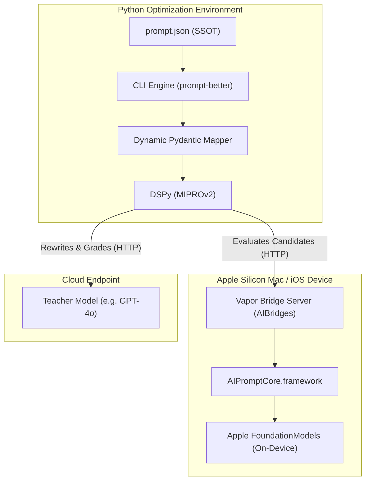

# Programmatic Prompt Optimization for On-Device Apple Models: Bridging the Gap with DSPy and `prompt-better`

Apple Intelligence and the release of Apple's on-device Foundation Models are transforming the mobile and desktop app landscape. Running AI locally is fast, private, offline-capable, and completely free of API request costs.

However, developers building native apps quickly run into a brick wall: **on-device models are small (typically 3B to 7B parameters) and highly sensitive to prompts.**

If you change a single word in your system prompt, a local model that was working perfectly might suddenly:

- Hallucinate or spit out empty text.
- Fail to output the JSON schema your app expects.
- Ignore critical constraints or instructions.

In the cloud, you can throw a massive, 100B+ model like GPT-4o at a problem and expect it to handle messy prompts with ease. On-device, prompt engineering becomes a exhausting, manual game of whack-a-mole. You tweak a sentence, check three examples, fix one failure, and inadvertently break five others.

## Enter DSPy—Stanford’s Prompt Compiler

To understand how we solve this, we must first look at Stanford University’s [**DSPy**](https://dspy.ai/) (Demonstrate-Search-Predict-Configure) library.

DSPy shifts the paradigm of prompt engineering from _manual hacking_ to _programmatic compiling_. Instead of treating prompts as static strings, DSPy treats them as parameterized functions (modules) that can be compiled.

Here is the core DSPy workflow:

1.  **Define a Signature**: Specify the inputs and outputs (e.g., `question -> answer`) declaratively, without writing the prompt text.
2.  **Build a Dataset**: Create a small training set of inputs and expected outputs (often just 20-50 examples).
3.  **Define a Metric**: Write a function that scores the model’s outputs (e.g., checks if the output matches a regex, calculates an F1 similarity score, or uses a teacher LLM to grade it).
4.  **Compile**: Run a DSPy optimizer (like `MIPROv2`). The optimizer automatically proposes instruction variations, runs them through the dataset, scores them, and compiles the best few-shot demonstrations into the prompt.

---

## The Gap Between DSPy and Apple Silicon

If DSPy is so powerful, why can't we just use it directly for Apple's local models? There are four major roadblocks:

1.  **API Disconnect**: Apple’s on-device model (`LanguageModelSession`) is only exposed via private Swift APIs on macOS/iOS. DSPy and the entire machine learning optimization stack are written in Python. Python cannot call Swift's local model session out-of-the-box.
2.  **Asymmetric Reasoning Capacity**: Advanced DSPy compilers like `MIPROv2` rely on a "meta-prompting" loop where the model writes prompt suggestions for itself and grades its own mistakes. A 3B on-device model lacks the reasoning capacity to critique its own prompts.
3.  **Resource Contention**: Running hundreds of optimization trials (generating and scoring prompts) directly on a device can exhaust the GPU memory, freeze the user interface, or take hours.
4.  **Fragile Structured Outputs**: App developers need structured data (like JSON). Small local models are notoriously bad at adhering to strict JSON schemas, leading to parse failures at runtime.

---

## Closing the Gap with `prompt-better`

`prompt-better` is a generic, platform-agnostic framework designed specifically to bridge Stanford's DSPy library with local/on-device hardware, with special integration for Apple Silicon.



It solves these challenges through three core innovations:

### 1. The Coached Student-Teacher Pipeline

Instead of forcing the on-device model to optimize itself, `prompt-better` uses an asymmetric **Student-Teacher optimization** scheme.

- **The Teacher (Cloud)**: A high-capacity model (like GPT-4o) acts as the coach. It analyzes errors, proposes instruction rewrites, and grades candidate outputs.
- **The Student (Local/On-Device)**: The target on-device model actually executes the proposed prompts on the local evaluation dataset.

By evaluating the candidates on the _actual_ target weights, the resulting instructions are tailored specifically to the unique capabilities, vocabulary, and biases of the local hardware.

### 2. The macOS/iOS Vapor Bridge

To solve the Python-to-Swift API disconnect, `prompt-better` includes a lightweight Vapor server (`AIBridges`). Running locally on your Mac or iOS device, the bridge translates incoming OpenAI-compatible REST requests into Apple's native `LanguageModelSession` Swift calls. This lets the Python-based DSPy engine call the local device over HTTP.

### 3. Single Source of Truth (`prompt.json`) & Pydantic Type-Safety

Instead of hardcoding prompt strings, you define prompts in a language-agnostic `prompt.json` file. At runtime, `prompt-better` reads this JSON and:

- Dynamically creates a **Pydantic model** for type validation.
- Automatically sets up the **DSPy Signature**.
- Runs a robust **JSON recovery and type coercion engine**. If the on-device model outputs malformed JSON, the library uses regex fallback extractors and coerces types (e.g. converting a string `"5"` to an integer `5` or a truthy string to a boolean) to prevent application crashes.
- Once optimized, generates type-safe, compile-ready **Swift structs** conforming to Apple's native patterns.

---

## Code Walkthrough: Optimizing an On-Device Classifier

Let's see it in action. We want to optimize a `TopicClassifier` prompt for an on-device model.

### Step 1: Define the Prompt Specification (`prompt.json`)

First, we write our prompt's structure in a language-agnostic format:

```json
{
  "name": "TopicClassifierPrompt",
  "config": {
    "temperature": 0.0,
    "max_tokens": 150
  },
  "instructions": {
    "prompt": "Classify the following text into one of these categories: Politics, Sports, Tech, Science, Entertainment.",
    "context": [
      {
        "name": "text",
        "type": "string",
        "desc": "The raw text input."
      }
    ]
  },
  "outputs": [
    {
      "name": "category",
      "type": "string",
      "desc": "The matched category."
    },
    {
      "name": "confidence",
      "type": "number",
      "desc": "Confidence score between 0.0 and 1.0."
    }
  ]
}
```

### Step 2: Fire Up the Local Apple Model Bridge

Start the Vapor bridge from the terminal on your Apple Silicon Mac:

```bash
cd AIBridges/macOS
swift run App serve --hostname 127.0.0.1 --port 8080
```

Your local Swift environment is now listening at port `8080`, ready to forward completion requests to Apple's local foundational models.

### Step 3: Run Baseline Validation

How does the default prompt perform? Let's validate it against our reference cases (golden-truths):

```bash
python3 -m prompt_better.cli validate \
  --prompts-dir example/prompts \
  --prompt TopicClassifierPrompt
```

The CLI runs the evaluation dataset against the student model, scoring outputs based on structural validity and semantic similarity against golden-truth references.

### Step 4: Let DSPy Optimize It

Now we run the optimizer. The Teacher (GPT-4o) drafts instruction candidates and critiques failures, while the Student (on-device Apple model) runs them:

```bash
python3 -m prompt_better.cli optimize \
  --prompts-dir example/prompts \
  --prompt TopicClassifierPrompt \
  --no-requires-permission-to-run \
  --apply
```

The compiler saves a detailed report and writes the winning, optimized instruction directly back to our `prompt.json`. The resulting prompt is optimized to get the absolute highest performance out of Apple's specific weights.

### Step 5: Export Type-Safe Swift Code

Finally, compile the optimized specification into native Swift code:

```bash
python3 -m prompt_better.cli generate \
  --source example/prompts/TopicClassifier/results/optimized-prompt.json \
  --target TopicClassifierPrompt.swift \
  --language swift
```

The generator outputs a type-safe Swift struct conforming to Apple's `@Generable` structure, complete with `@Guide` metadata and sampling settings:

```swift
// TopicClassifierPrompt.swift
import Foundation
import AIPromptCore

public struct TopicClassifierPrompt: GenerableWithPrompt {
    public let text: String

    public struct Output: Codable {
        @Guide(description: "The matched category.")
        public var category: String

        @Guide(description: "Confidence score between 0.0 and 1.0.")
        public var confidence: Double
    }

    // ... Metadata and optimized instructions embedded automatically
}
```

---

## Under the Hood: The Resilience Registry

A key feature that makes this reliable is `prompt-better`'s robustness layer. In `prompt_better/dspy_manager/openai_structured.py`, the framework implements a pluggable fallback registry.

When local models return messy text instead of clean JSON, `prompt-better` attempts to:

1.  Strip markdown block backticks (` ```json `).
2.  Use regex to search for the outer `{}` or `[]` boundary.
3.  Apply standard fallback layouts (like `teacher_grade` or custom user extractors).
4.  Run a **Type Coercion Engine** that looks at the Pydantic schema and dynamically casts types (e.g. matching float patterns, translating lists, converting truthy text to booleans).

This ensures that your application doesn't crash even if the underlying local model outputs a slightly off-format response.

---

## Why This Matters for Modern App Development

By treating prompts as software assets that can be compiled and validated, `prompt-better` changes how we build on-device AI apps:

- **Decoupling**: Prompts are stored in clean JSON files, completely separated from Swift or Python codebases.
- **Asymmetric Compilation**: We leverage the cloud's intelligence (Teacher) to optimize prompts that run cheaply, privately, and fast on the user's device (Student).
- **No More Magic Wording**: You don't need to spend hours guessing whether "be concise" works better than "keep it brief." Let the DSPy compiler find the mathematical optimum.

By putting compile-time engineering into prompt design, we bring standard software safety and automation to the local LLM stack.

_Check out the [prompt-better](https://github.com/pkcpkc/prompt-better) repository and start compiling better prompts today!_
